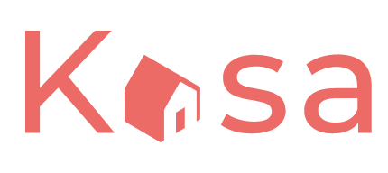

## KASA

# Frontend for Peer-to-Peer Apartment Rental Platform

## $\color{red}{Objectif}$

Kasa is a web application that allows users to browse and view information about different apartments. It provides a gallery of apartments with detailed information, such as location, amenities, and host details.

  
   ## $\color{red}{Features}$

* View a gallery of apartments with their cover images and titles.

* Click on an apartment to view more details, including description, amenities, and host information.

* Navigate through different pages using the header navigation menu.

* The app includes a Home page, About page, and a detailed view page for each apartment.

* The app is built using React and utilizes React Router for navigation.

## $\color{red}{Prerequisites}$
  * **Node.js**: Ensure that you have Node.js installed on your machine. You can download it from the official Node.js website and follow the installation instructions.

## $\color{red}{Installation}$
  

1. **Clone the repository**:

        git clone https://github.com/samarkand-fr/Kasa_p11.git

2. **Navigate to the project directory** :

        cd Front-End

3.  **Install dependencies**:
      Run the following command to install the project's dependencies using npm  (Node Package Manager).

         npm install

4.  **Configure environment variables:** 
       You can customize the port on which the application will run by modifying the value of the PORT environment variable in the .env file. By default, the port is set to 3006.

5. **Launch the application**: 

        npm start

You can access the application in your browser at http://localhost:3006 (or the port you have set).